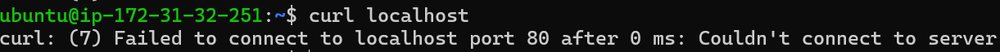

# Troubleshooting Lab 除錯報告

首先依照問題敘述測試 `curl localhost` 的結果，得到預期的錯誤訊息，此時使用指令查看 nginx 服務狀態時得到下列的結果：

```shell
$ sudo systemctl status nginx
```


```shell
$ sudo nginx -t
```


因此前往 nginx 的設定檔 `/etc/nginx/nginx.conf` 做檢查，發現檔案內有語法錯誤 (多了一個 `;`)，將其修正之後使用上方的 `sudo nginx -t` 確認 nginx 的設定檔沒有其他的問題


另外在 `etc/nginx/sites-available` 中的 `default` 檔案進行查看，確認 error log 的目錄位置在 `/var/log/myweb/error.log`


進入 `error.log` 中查看相關錯誤訊息，發現到 nginx sites 設定檔中指向的 `index.html` 有權限的限制


因此使用以下指令調整該檔案權限：

```shell
$ chmod 644 /var/myweb/index.html
```

調整後進入該檔案確認可以正常查看檔案內容

此時再度檢查 nginx 服務的狀態，顯示 nginx 預設使用的 80 port 遭到占用


故使用以下指令來查看當前運行的所有程序及其使用的 port number，發現到 80 port 確實被另一個 `srv` process 佔據

```shell
$ sudo lsof -i -P
```


因此手動將該程序關閉以清出 80 port 提供 nginx 來使用

```shell
sudo kill 577 # srv 的 PID
```

操作完成後，檢查 nginx 服務的狀態，以及設定檔的運作皆沒有問題，但測試 `curl locahost` 卻仍然無法顯示預期的成功回應，出現無法連線到 80 port 的錯誤訊息




最後檢查防火牆相關的設定，發現到在 INPUT 的 chain 中存在一個 REJECT 規則來阻擋 tcp 連線

```shell
$ sudo iptables -L # 列出所有的規則
```


因此將這項規則移除，後續再次測試即可看到正常的回應畫面，除錯結束

```shell
$ sudo iptables -D INPUT 1 # -D 代表刪除，並選擇 INPUT chain，1 則是規則編號
```

## 後續處理

由於重新啟動 instance 後，發現到除了檔案、權限的改動外，其餘包含 srv 服務占用 80 port、防火牆的限制又會重新恢復到除錯錢的狀態，因此嘗試解決這些問題，目前發現到的可能解法如下：

1. 更改 `iptables` 的設定檔：在 `/etc/iptables/rules.v4` 中可以尋找到設定檔，查看裡面的內容發現到預設的 REJECT 規則被記錄在裡面，將其註解起來後，重新啟動 instance 並檢查防火牆發現該 REJECT 的規則不會再被預設設定了

2. 刪除 `srv.service`：刪除位於 `/usr/lib/systemd` 的 `srv.service` 設定檔，使其不會在 instance 開啟時啟動，占用住 80 port

不過進行完以上操作後，重新啟動 instance 仍然需要執行 `sudo systemctl restart nginx` 才能讓 nginx 順利啟動

## 心得感想

經過一連串的除錯過後，體會到在發現問題的過程中有許多要注意的地方，必須要對整個系統的架構、運行原理有一定程度的認識才能慢慢地找出所有錯誤。例如要掌握 nginx 的基本知識，了解到要如何查看 nginx 的運作狀態，再到對應的地方去檢查確認，一個一個地排除，也要對操作的指令有一定的熟悉度，才知道每一次的指令實際上變動的內容為何。最後還有防火牆的這塊是當初比較沒有特別想到的，如果對防火牆的概念不夠明確，可能就會在排除 nginx 相關的設定後就卡住了。這次的 lab 除了體驗從頭到尾從系統的訊息找出問題的核心外，也對整個系統的運作流程有了更深刻的理解。
